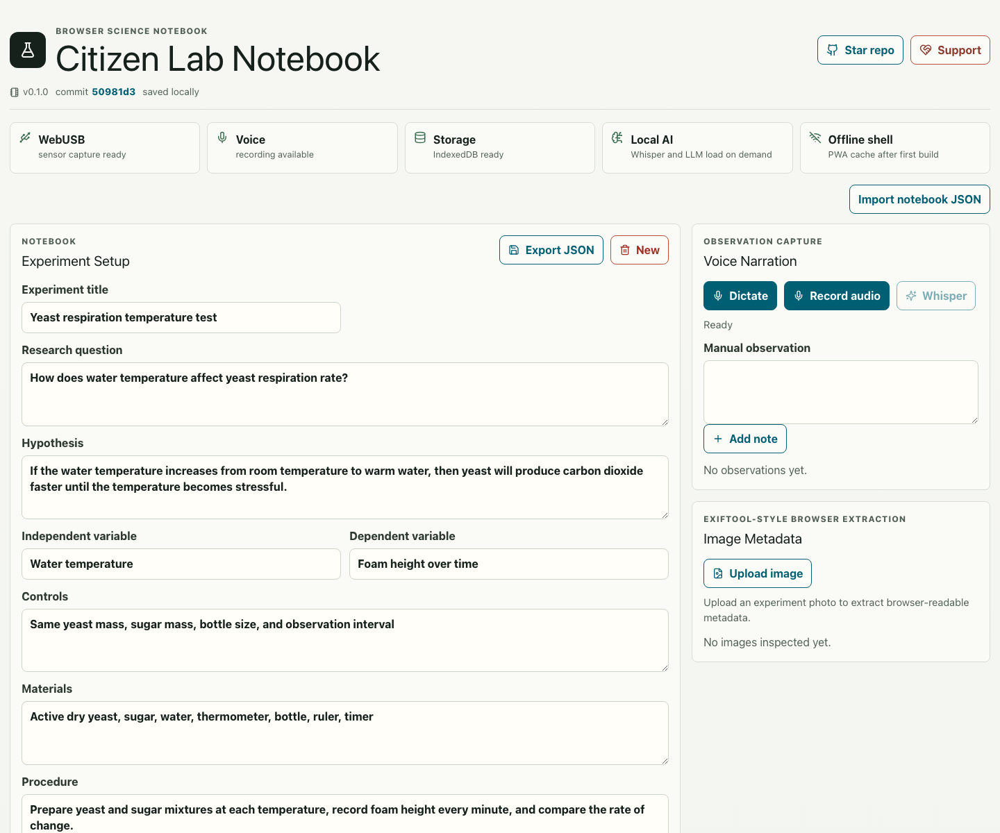

# Citizen Lab Notebook

[](https://baditaflorin.github.io/citizen-lab-notebook/)
[](docs/adr/0001-deployment-mode.md)
[](LICENSE)

Live site: https://baditaflorin.github.io/citizen-lab-notebook/

Repository: https://github.com/baditaflorin/citizen-lab-notebook

Support: https://www.paypal.com/paypalme/florinbadita

Citizen Lab Notebook is a browser-based science fair notebook for capturing observations, sensor data, figures, metadata, and report drafts without a hosted backend. It is built for students and amateur scientists who need the useful parts of a lab notebook/reporting workflow without a paid ELN subscription.



## Quickstart

```sh
npm install
make dev
make test
make build
make pages-preview
```

## What Works

- Experiment setup fields for question, hypothesis, variables, materials, procedure, and safety notes.
- Voice observations through browser dictation, audio recording, and optional local Whisper transcription.
- Sensor data through sample data, CSV import/export, and WebUSB capture where the browser/device supports it.
- JavaScript statistics, SVG figures, and optional Pyodide analysis with matplotlib and SymPy.
- Browser image metadata extraction for EXIF/IPTC/XMP-style fields.
- Generated lab report with stats, figure, report sections, print-to-PDF, HTML export, and optional local model drafting.
- IndexedDB local persistence, JSON import/export, PWA shell, visible app version, and latest public commit link.

## Status

This repository is implemented as a Mode A GitHub Pages application. The frontend is the product: browser storage, local computation, lazy WASM/model loading, and static publishing from `docs/`.

## Architecture

Architecture guide:

docs/architecture.md

ADRs:

docs/adr/

Privacy:

docs/privacy.md

## Deploy

GitHub Pages serves `docs/` from the `main` branch:

https://baditaflorin.github.io/citizen-lab-notebook/

Manual deploy and rollback notes:

docs/deploy.md
