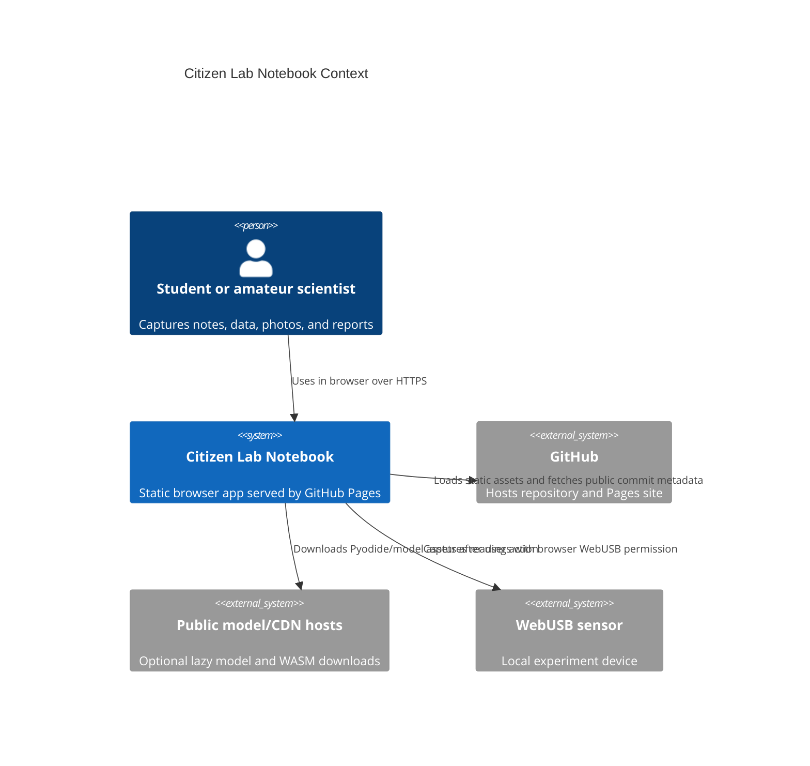
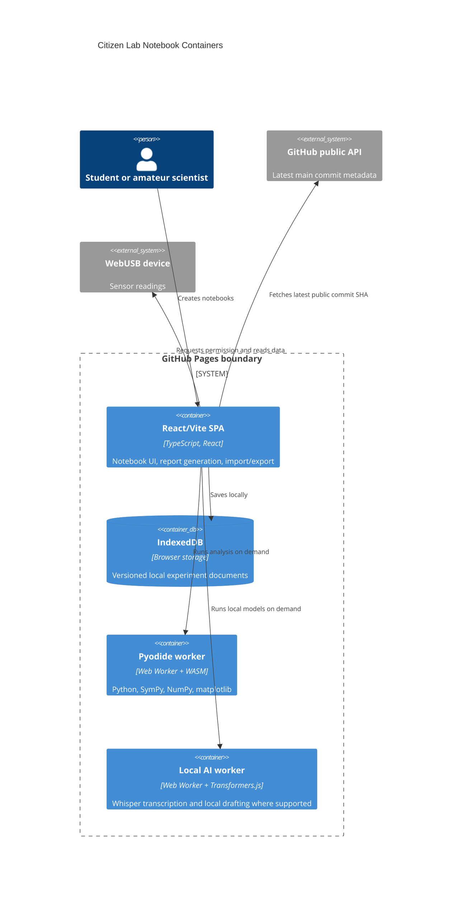

# Architecture

Citizen Lab Notebook is a Mode A static GitHub Pages app. There is no runtime backend, no hosted database, and no frontend secret.

## C4 Context

## C4 Container

## Module Boundaries

- `src/features/experiments/` edits experiment setup and notebook identity.
- `src/features/voice/` records observations and talks to the local AI worker.
- `src/features/sensors/` imports CSV, generates demo data, and captures WebUSB readings.
- `src/features/analysis/` computes JavaScript stats, renders SVG figures, and runs Pyodide.
- `src/features/images/` extracts browser-readable EXIF/IPTC/XMP metadata.
- `src/features/report/` builds report sections and standalone HTML export.
- `src/lib/` contains storage, download, logging, and build metadata helpers.
- `src/workers/` isolates heavy Pyodide and model runtime work.

## Live Boundaries

Live app:

https://baditaflorin.github.io/citizen-lab-notebook/

Repository:

https://github.com/baditaflorin/citizen-lab-notebook
